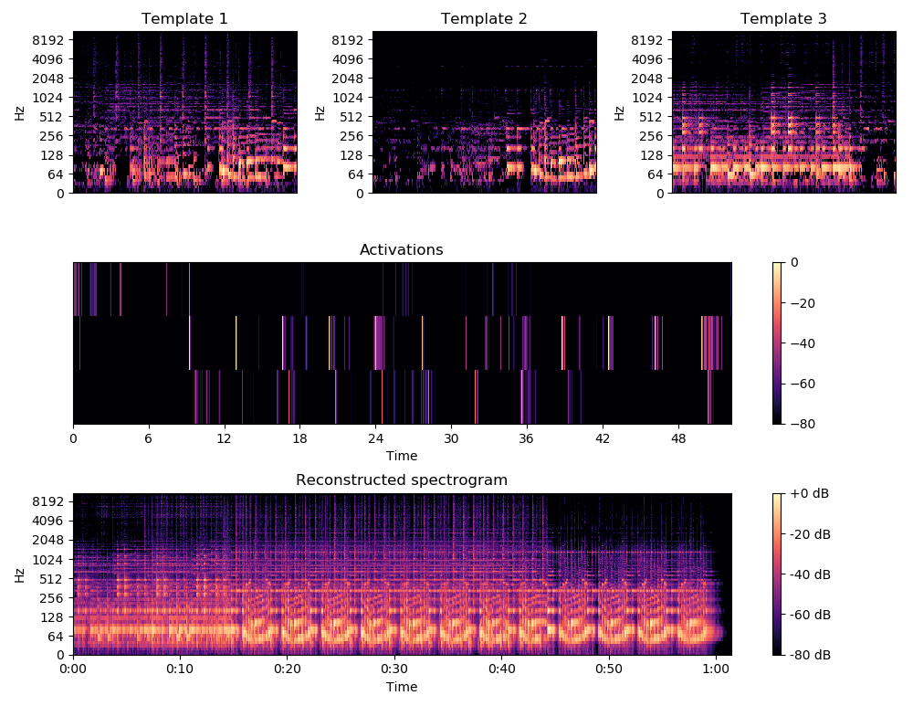
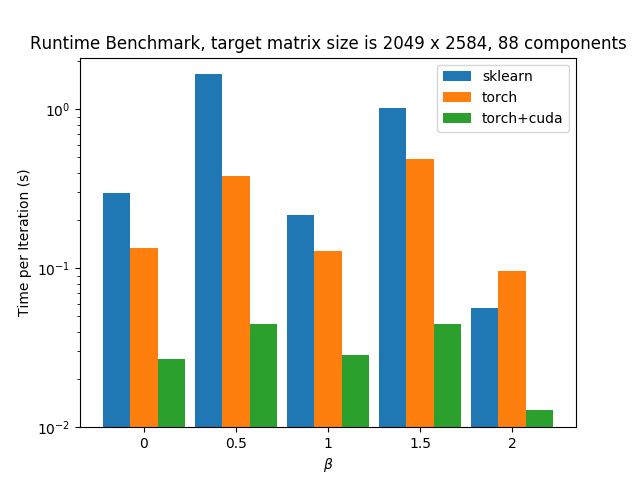

# Non-negative Matrix Fatorization in PyTorch

PyTorch is not only a good deep learning framework, but also a fast tool when it comes to matrix operations and convolutions on large data.
A great example is [PyTorchWavelets](http://github.com/tomrunia/PyTorchWavelets).
 
In this package I implement basic NMF and NMFD module minimizing beta-divergence using multiplicative update rules, 
and is based on `torch.nn.Module` so the models can be moved freely among CPU/GPU devices.
Part of the multiplier is obtained via `torch.autograd` so the amount of codes is reduced and easy to maintain 
(only the denominator is calculated).

The interface is similar to `sklearn.decomposition.NMF` with some extra options.

## Usage

Here is a short example of decompose a spectrogram.

```python
import torch
import librosa
from torchnmf import NMF
from torchnmf.metrics import KL_divergence

y, sr = librosa.load(librosa.util.example_audio_file())
y = torch.from_numpy(y)
windowsize = 2048
S = torch.stft(y, windowsize, window=torch.hann_window(windowsize)).pow(2).sum(2).sqrt().cuda()

R = 8   # number of components

net = NMF(S.shape, n_components=R, verbose=True, beta_loss='kullback-leibler').cuda()
# run extremely fast on gpu
_, V = net.fit_transform(S)      # fit to target matrix S
print(KL_divergence(V, S))        # KL divergence to S
```
A more detailed version can be found [here](tests/librosa_example.py), which redo this [example](https://librosa.github.io/librosa/generated/librosa.decompose.decompose.html#librosa.decompose.decompose)
with NMFD.



## Compare to sklearn

The barchart shows the time cost per iteration with different beta-divergence.
It is clear that pytorch-based NMF is faster than scipy-based NMF (sklearn) when beta != 2 (Euclidean distance), 
and run even faster when computation is done on GPU. The test is conducted on a Acer E5 laptop with i5-7200U CPU and GTX 950M GPU.

 

## Installation

Using pip:
```
pip install git+http://github.com/yoyololicon/pytorch-NMFs
```

Or clone this repo and do:
```
python setup.py install
```

## Requirements

* Pytorch == 0.4.1

## Tips

* If you notice significant slow down when operating on CPU, please flush denormal numbers by `
torch.set_flush_denormal(True)`.
* Replace zeros in target matrix with small value to avoid overflow.

## TODO

- [ ] Support sparse matrix.
- [ ] Regulariztion.
- [ ] NNDSVD initialization.